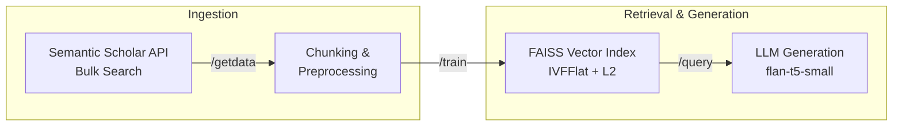

# RAG Pipeline: Domain-Specific Question Answering 

A production-oriented Retrieval Augmented Generation(RAG) system that ingests documents from external APIs, indexes them from semantic search and generates contextual answers using **local LLMs** - more so for regulated industries.

**Current use case:** Lithium-ion battery tech research papers from Semantic Scholar

The pipeline is domain agnostic, swap the data data source, loader and prompt to appy it to any knowledge domain (legal, financial and regulated industries)

--- 
## Architecture 



## Pipeline Stages 

### 1. Data Acquisition (`/getdata`)
Bulk-fetch from  [Semantic Scholar Academic Graph API] (https://api.semanticscholar.org/)

- **Endpoint:** `GET /paper/search/bulk`
- **Query:** Lithium-ion (configurable)
- **Fields :** title, abstract, URL, year, reference count
- **Output :** JSON files stored in `dataset/`

**Design Decisions:**
- Bulk API over paginated search
- Idempotent - skips download if data already exists
- Raw JSON preserved for experimenting different **chunking strategies** 

### 2. Document Chunking (`/train`) 

Transforms raw JSON into LangChain `Document` objects, then splits into retrieval-optimized chunks

**Design Decisions:**

- Recursive splitting over fixed-size respects natural text boundaries
- No overlap (configurable) 
- Pluggable loader architecture - **PDF/ CSV**

### 3. Vector Indexing (`\train`)
Embeds chunks and builds FAISS index for **sub-millisecond** similarity search

- **Embedding Model:** `all-MiniLM-V6-v2` (384-dim, 6-layer sentence transformer)
- ** Index type:** `IndexIVFFlat` with L2 distance (`nlist` = 100 Voronoi cells)
- Trained on document embeddings before insertion.
- **Persistance :** Index saved to `.index` file + metadata as `.pkl` (doc store, ID mapping)
- **ID tracking:** Support incremental update - new documents get sequential ID without rebuilding 

**Decision Decisions:**
|Design|Rationale|
|-------|-----|
|IVFFlat over brute-force (IndexFlatL2)|  scales to 100K+ documents with approximate search| 
|MiniLM over large models | 5x faster encoding with minimal quality loss for short-text (abstracts) |
|Custom FAISS wrapper over LangChain's FAISS| Full control over index, params, - **regulatory reasons - audit, trace etc** |

#### 4. Query and Generation (`/query`)
Retrievs relevant chunk via similarity search, then generates answer with **Local LLM**

- **Retrieval:** Top 5 nearest neighbors from FAISS index
- **LLM:** `google/flan-t5-small` (default ~300MB)- autodownloaded from HuggingFace
- **Chain:** LangChain `load_qa_chain` with custom prompt template
- **Prompt:** Structured with `<info>`, `<question>`, `<context>` tags for clear instruction following

**Design Decisions:**
- Local inference over API calls- zero latency, **no cost per query**, works offline
- Flat-t5 over GPT-Neo : seq2seq architecture better suited for extractive QA and short contexts
- Configurable model selection via env `.env` (BASE_LLM) - **swap models**

## Quick Start

```bash

curl -LsSf https://astral.sh/uv/install.sh | sh 

# Setup 
uv venv .venv --python 3.11
source .venv/bin/activate 
uv pip install -e .

#Run 
python main.py 


# Pipeline 
# 1. download 
curl http://localhost:5000/getdata 
# 2. chunk + index 
curl http://localhost:5000/train

curl -X POST http://localhost:5000/query\
 -H "Content-type: application/json" \ 
 -d '{"query":"What cause lithium -ion battery degradation?"}'  
```
